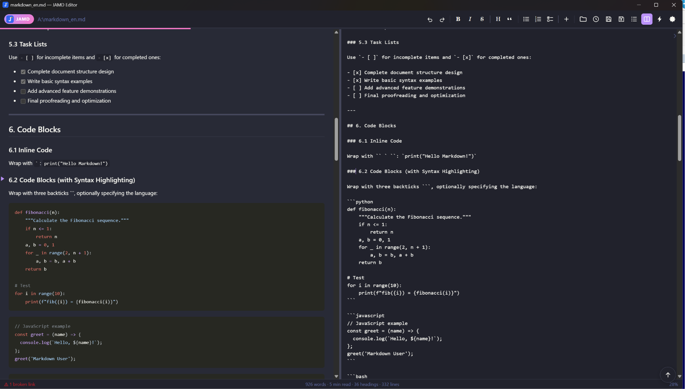
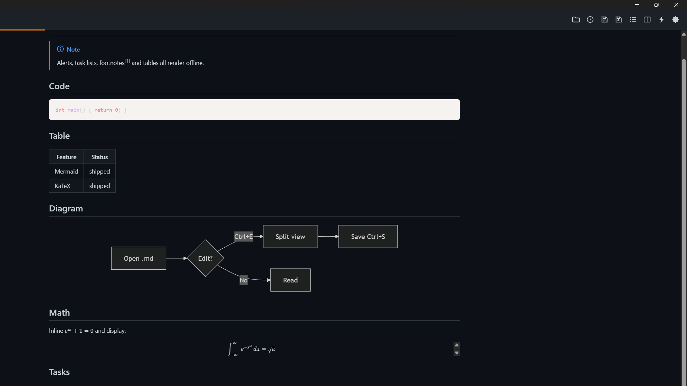
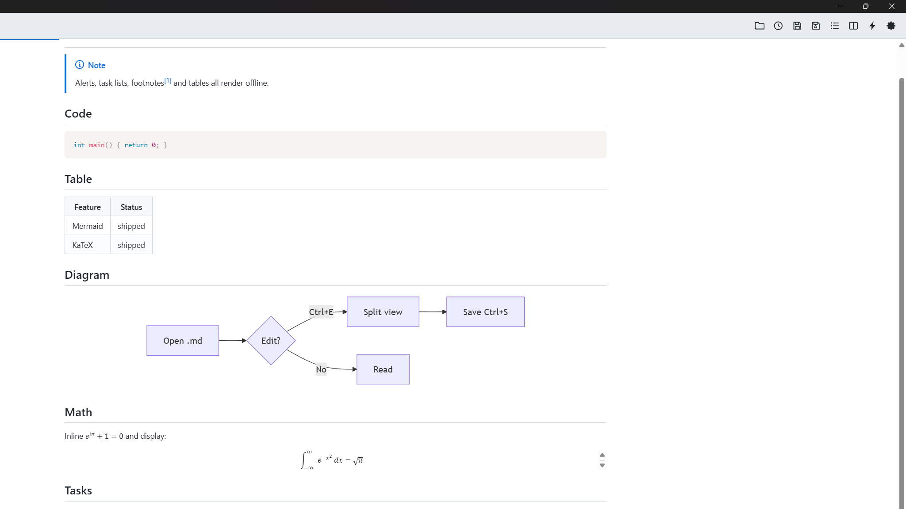

<div align="center">


# Just Another MarkDown Editor — **JAMD Editor**

A fast, 0.5 MB single‑executable **Markdown viewer & editor** for Windows.
Viewer‑first, fully offline, no install — one native `.exe` powered by Win32 + WebView2.
Editor as add-on for Total Commander viewer plugin WLX at [JAMD-WLX](https://github.com/mikinko/JustAnotherMarkdown_lister_WLX)

</div>

---



## Why another Markdown editor?

JAMD is built to be the app which opens instantly,
renders GitHub‑Flavored Markdown exactly, and lets you drop into a live source editor with
**Ctrl+E** when you actually want to change something. No Electron, no telemetry, no cloud —
a single ~2 MB executable with its assets beside it. Working with AI models, MD files are everywhere, all editors are huge, cloud, whatever. So this is quick, small, do what it should do. 

## Features

**Rendering**
- Full GitHub‑Flavored Markdown: tables, task lists, footnotes, strikethrough
- GitHub‑style **alerts** (`> [!NOTE]`, `[!TIP]`, `[!WARNING]`, …)
- **Mermaid** diagrams and **KaTeX** math — rendered locally, no network
- Syntax highlighting (Prism) with several selectable code themes
- Data views: JSON / YAML / TOML rendered as a collapsible tree; sandboxed HTML preview

**Editing**
- Toggleable split editor with a **line‑accurate scroll sync** and a caret‑position marker
- Formatting **toolbar**: undo/redo · bold · italic · strikethrough · heading · quote ·
  bullet / numbered / checklist · insert link, image, table, code block
- Smart typing: list/quote continuation on Enter, table cell navigation with Tab, auto‑indent
- **Find & replace** with match‑case, wrap, replace‑all
- Paste an image → stored next to the document under `img/`; or insert one from a file
- Preserves the document's original encoding (BOM) and EOL style (CRLF/LF) on save

**Workflow**
- **Quick open** (Ctrl+K) across recent files and the current folder
- Recent‑files list, drag & drop, open a file as a launch argument (TC F3 viewer)
- **Presentation mode** (F5) — slides split on `---` or headings
- Export to **HTML** and **PDF**
- Autosave crash‑recovery and external‑change detection (reload prompt)
- Themes: GitHub Light / Dark / system‑auto, plus JSON theme presets in `themes/`
  (Dracula, Nord, Tokyo Night, One Dark, Gruvbox, Solarized)
- Table of contents, adjustable zoom & reading width, line numbers

## Screenshots

| Reading view (dark) | Reading view (light) |
| --- | --- |
|  |  |

## Keyboard shortcuts

| Key | Action | | Key | Action |
| --- | --- | --- | --- | --- |
| `Ctrl+O` | Open | | `Ctrl+K` | Quick open |
| `Ctrl+S` | Save | | `Ctrl+H` | Find & replace |
| `Ctrl+Shift+S` | Save As | | `Ctrl+T` | Table of contents |
| `Ctrl+E` | Toggle source / split | | `Ctrl+L` | Line numbers |
| `Ctrl+D` | Toggle theme | | `Ctrl+G` | Scroll to top |
| `F5` | Presentation mode | | `Ctrl+Q` | Sync the two panes |
| `F1` | Help | | `Esc` | Close / back |

In the editor: `Ctrl+B` bold · `Ctrl+I` italic · `Ctrl+Shift+F` reformat table ·
`Tab` cell navigation / indent · `Enter` continues lists and quotes.

## if you want buy me coffee , ill be glad, if not, enjoy anyway
  
or here
[Buy Me a Coffee](https://buymeacoffee.com/mikinko)


## Building

Requirements:
- Windows 10/11
- Visual Studio 2022 (MSVC toolset) and **CMake ≥ 3.16**
- **WebView2 Runtime** (pre‑installed on Windows 11) and the WebView2 SDK NuGet
  package `Microsoft.Web.WebView2.1.0.2592.51` restored under `build/packages/`

```sh
cmake -B build -A x64
cmake --build build --config Release
```

The result is a self‑contained `build/Release/JAMDedit.exe` (static CRT) with `lib/` and
`themes/` copied beside it. The frontend (`src/index.html`) and app icon/logo are embedded
as resources; only the drop‑in `lib/` libraries and `themes/` presets live on disk.

## Usage

```sh
JAMDedit.exe path\to\file.md
```

No argument opens an empty buffer. To use it as the Total Commander **F3** viewer or the
default `.md` program, just point it at `JAMDedit.exe` — it takes a single path argument.

## Architecture

A single WebView2 fills the window; **all UI is HTML**, and the source editor is an in‑page
`<textarea>`, which gives native undo/redo and same‑DOM scroll sync for free. The native
Win32 side is deliberately thin: window + dark titlebar, WebView2 lifecycle, file dialogs and
UTF‑8 I/O, the settings INI, and a small string message protocol between page and host.
Documents and assets are served to the page over a synthetic origin via `WebResourceRequested`.

## License

Not yet licensed — add a `LICENSE` file to declare usage terms.
