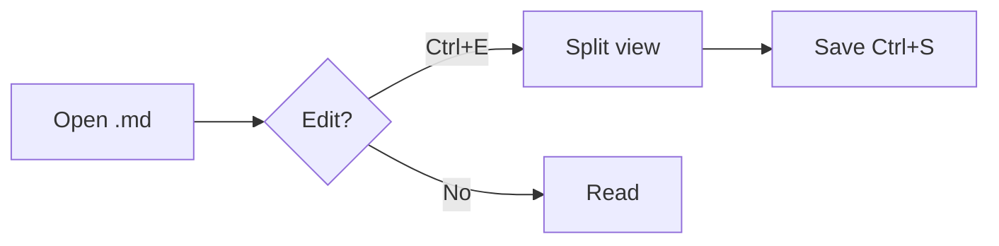

# MDedit feature test

> [!NOTE]
> Alerts, task lists, footnotes[^1] and tables all render offline.

## Code

```cpp
int main() { return 0; }
```

## Table

| Feature | Status |
|---------|--------|
| Mermaid | shipped |
| KaTeX   | shipped |

## Diagram



## Math

Inline $e^{i\pi} + 1 = 0$ and display:

$$\int_{-\infty}^{\infty} e^{-x^2}\,dx = \sqrt{\pi}$$

## Tasks

- [x] Remove bionic reading
- [x] Editor collapse button
- [x] Markdown syntax help (F1)

[^1]: A footnote.
