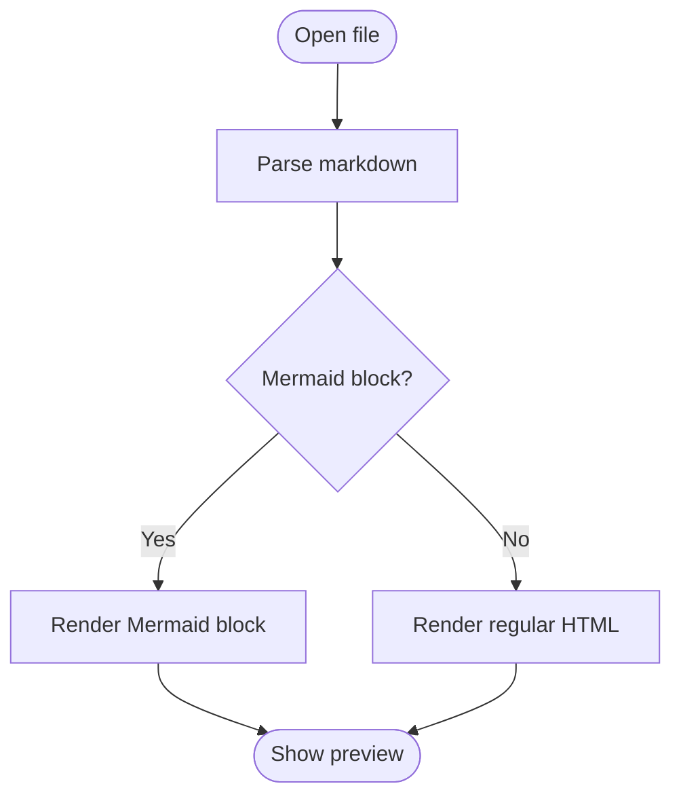
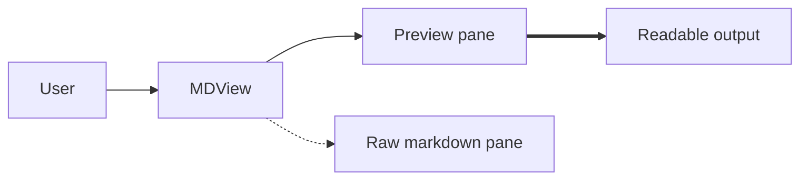
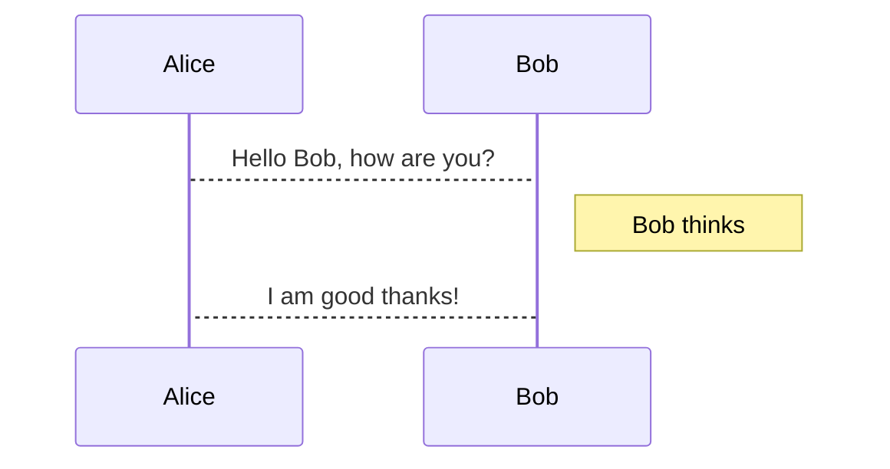
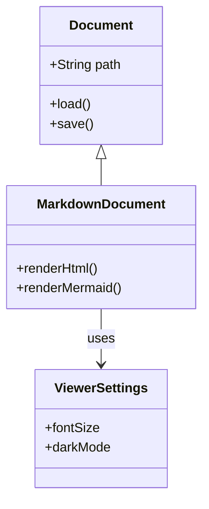
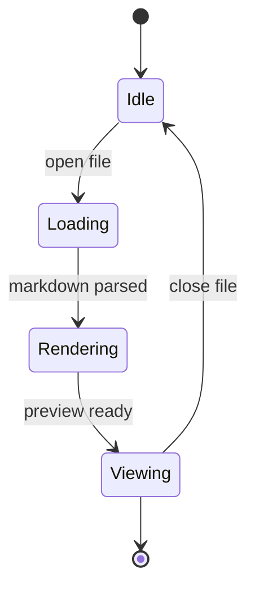

# Mermaid Support Test File

This document exercises every Mermaid diagram type currently supported by MDView.

The current built-in renderer supports:

- `graph` / `flowchart`
- `sequenceDiagram`
- `classDiagram`
- `stateDiagram-v2`

## Flowchart Top To Bottom

## Flowchart Left To Right

## Sequence Diagram

This sample intentionally mirrors the less common Mermaid fragment placed near the end of `test.md`.

## Class Diagram

## State Diagram

## Notes

- Mermaid rendering is self-contained inside the plugin binaries.
- Unsupported Mermaid syntaxes should fall back to the original source block.
