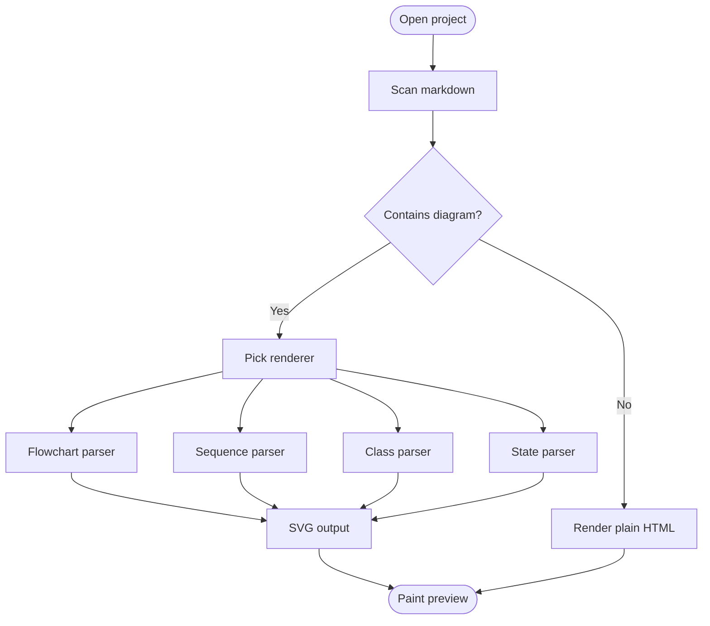
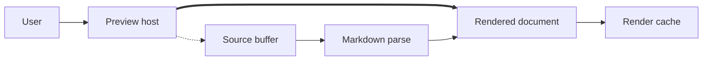
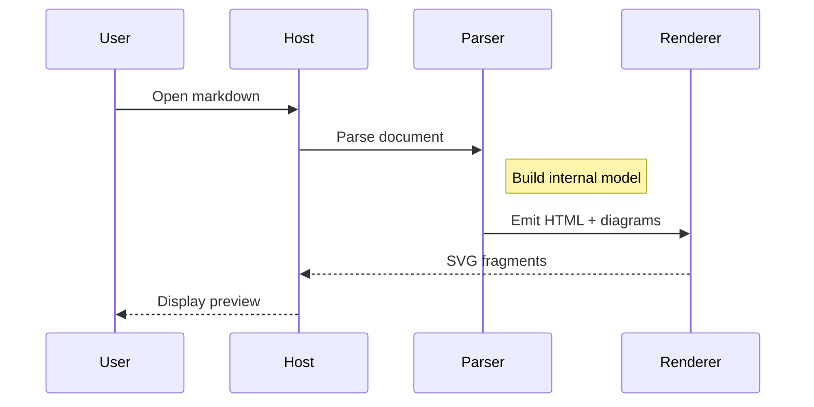
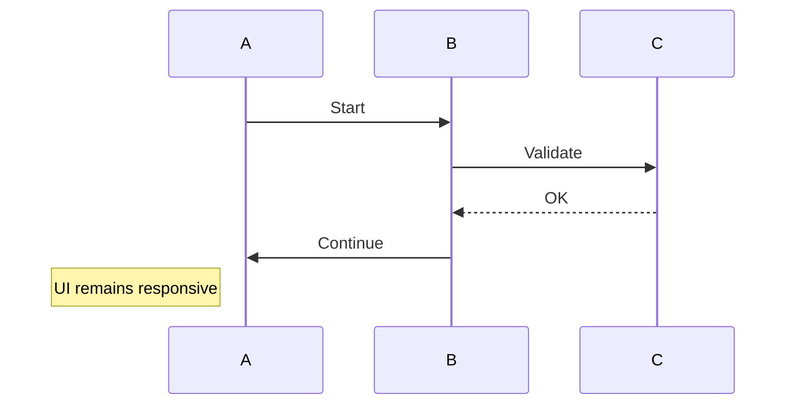
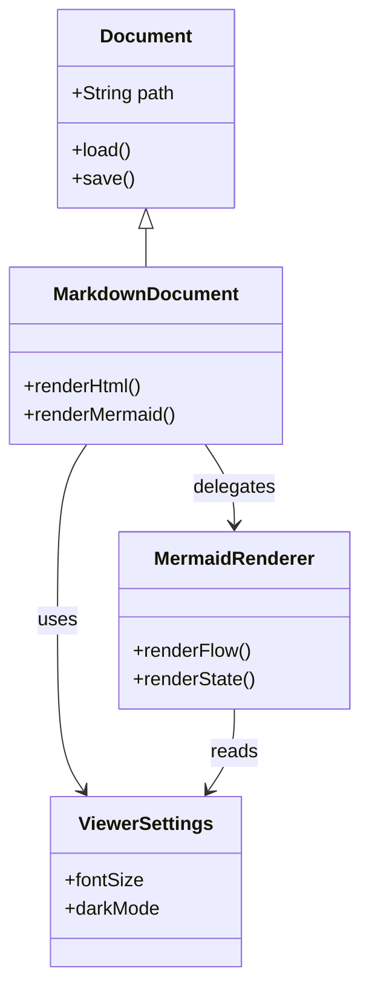
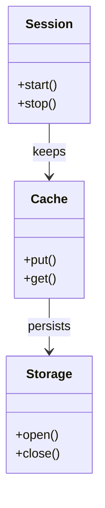
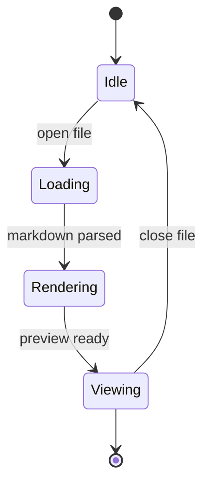
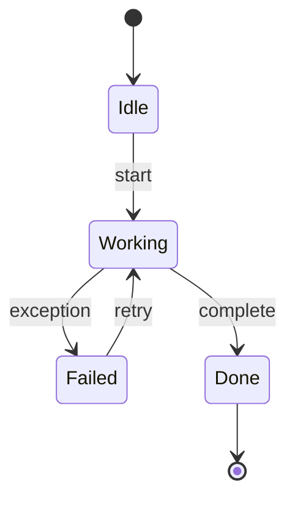
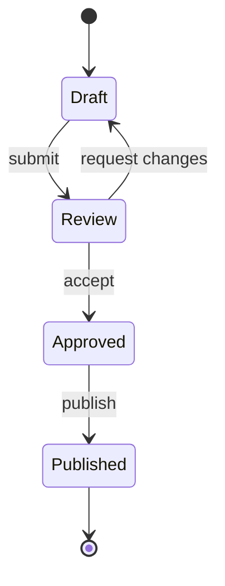

# Mermaid Regression Stress Cases

This file is meant to exercise the currently supported Mermaid subsets in MDView with more demanding layouts.

## Flowchart TB Dense

## Flowchart LR Mixed Links

## Sequence Diagram With Notes

## Sequence Diagram Cross Traffic

## Class Diagram Dense Relations

## Class Diagram Vertical Link

## State Diagram Linear Return

## State Diagram Retry Path

## State Diagram Long Return

